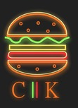
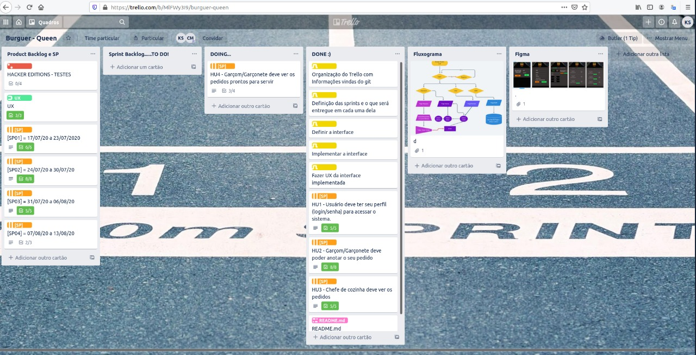
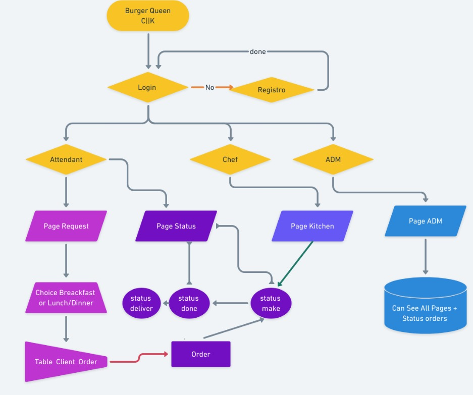
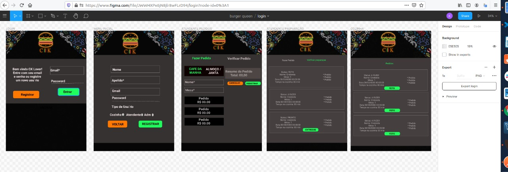

  

---

## Índice

- [1. Apresentação](#1-apresentacao)
- [2. Resumo do projeto "história do Usuário"](#2-resumo-do-projeto-historia-do-Usuario)
- [3. Planejamento](#3-planejamento)
- [4. Teste de Usabilidade](#4-teste-de-usabilidade)
- [5. Autoria e Considerações Finais](#5-autoria-e-consideracoes-finais)

---

## 1. Apresentação
É uma interface feita em React para gerenciamento de forma ágil e clara entre o atendimento e a cozinha de um restaurante. A aplicação deste projeto você pode acessar através do link abaixo:

https://burguer-queen-26760.web.app/

---

## 2. Resumo do Projeto "história do Usuário"

##### História de usuário 1 critérios de aceitação:
* Criar Login e senha.
* Registar tipo de usuário (cozinha / salão), login e senha.
* Entrar na tela correta para cada usuário.

### História de usuário 2Critérios de aceitação:
* O setor de atencimento anotar o nome e mesa.
* O setor de atencimento adicionar produtos aos pedidos.
* O setor de atendimento excluir produtos.
* O setor de atendimento ver resumo e o total da compra.
* O setor de atendimento enviar o pedido para a cozinha (guardar em algum banco de dados).
* O setor de atencimento funcionar bem e se adequar a um tablet 

### História de usuário 3Critérios de aceitação:
<li>O setor da cozinha ver os pedidos à medida em que são feitos.</li> 
<li>O setor da cozinha marcar os pedidos que foram preparados e estão prontos para serem servidos.</li> 
<li>O setor da cozinha ver o tempo que levou para preparar o pedido desde que chegou, até ser marcado como concluído.</li>  

### História de usuário 4Critérios de aceitação:
<li>O setor do atendimento vê a lista de pedidos prontos para servir.</li> 
<li>O setor do Atendimento marque os pedidos que foram entregues.</li>  
## 3. Planejamento

<b>Trello</b>
Utilizamos a Ferramenta Trello para o planejamento, organização e acompanhamento das sprints, tinhamos alinhamentos todo o final do dia e trabalhamos em   pair programming optamos por usar o live share do visual code para facilitar esta interação, tivemos dailys diárias nos períodos do curso para saber onde cada uma estava e assim ambas estarem sempre lado a lado.
Quando tinhasmos problemas ou estavamos travadas, uma procurava a outra e tenvamos nos ajudar para não perder muito tempo com bugs.

<b>Trello</b>

  

<b>Fluxograma</b>
Desenhamos o esqueleto da interface para ficar de melhor forma o planejamento, demos nossos primeiros passos utilizando nosso fluxograma como pode ver abaixo:

  

<b>Figma</b>
Nosso protótipo foi de grande valia neste projeto o Figma nos ajudou a, testar as usabilidades para ver ser haveria algo fora do local, o mais legal é que podemos mostrar para varios avaliadores para testar nossa interface.
Além de dar um corpo ao nosso esqueleto do Fluxograma

  

## 4. Teste de Usabilidade
Durante a criação do projeto fizemos teste de usabilidade com os usuários. No teste, o principal erro foi a falta de um Adm para administrar tanto o atendimento quanto a cozinha. Assim corrigimos os problemas apresentados e seguimos com nosso projeto

## 5. Autoria e Considerações Finais

Interface foi desenvolvida em tablets first.
Aplicativo Web responsivo.
O aplicativo é um Single Page App.

Ferramentas e bibliotecas:
JavaScript (ES6 +)
React.js (Hooks)
React Router Dom
HTML5
CSS3
Firebase
Eslint
Prettier
Material UI
Trello
Figma

<b>Desenvolvido por:</b>
Esse projeto foi desenvolvido em dupla por Carolina Mosqueta e Karina Pereira como parte do bootcamp < Laboratoria >. Foi um grande desafio que trouxe um grande aprendizado!

  
